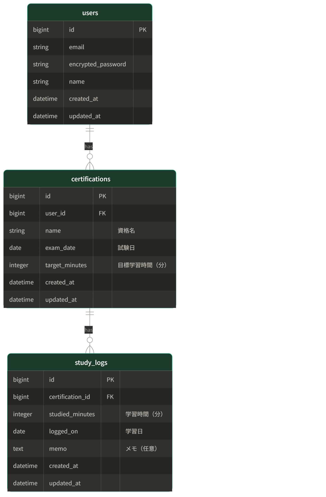

# 資格取得ペース管理アプリ

> 「受験申込済みの社会人エンジニアが、今自分が合格ペースに乗れているかを30秒で確認できる唯一のサービス」

---

## サービス概要

| 項目 | 内容 |
|------|------|
| 概要 | 受験申込済みの社会人エンジニアが、試験日から逆算して「今日自分が合格ペースにいるか」を即座に確認できるWebサービス |
| 対象 | IPA・Oracle試験に申込済みで、受験料を払ったにもかかわらず学習が止まってしまっている社会人エンジニア |
| 解決策 | 「合格ペースか否か」をダッシュボード1画面で見せることで、毎日アプリを開くだけで不安と先送りを解消する |

---

## 開発環境のセットアップ

### 必要なもの

- Docker Desktop（WSL2 統合を有効化すること）
- Git

### 初回セットアップ手順

```bash
# 1. リポジトリのクローン
git clone <リポジトリURL>
cd runteq-portfolio1

# 2. 環境変数ファイルの作成
cp .env.example .env

# 3. イメージのビルド
docker compose build

# 4. データベースの作成
docker compose run web rails db:create

# 5. サーバーの起動
docker compose up
```

ブラウザで http://localhost:3000 にアクセスして動作確認してください。

### よく使うコマンド

| コマンド | 説明 |
|---|---|
| `docker compose up` | サーバー起動 |
| `docker compose down` | サーバー停止 |
| `docker compose exec web bash` | コンテナ内のシェルに入る |
| `docker compose exec web rails c` | Rails コンソール |
| `docker compose exec web rails db:migrate` | マイグレーション実行 |
| `docker compose exec web bundle exec rspec` | テスト実行 |

---

## 技術スタック

| 項目 | 技術 |
|------|------|
| フレームワーク | Ruby on Rails 7.1 |
| DB | PostgreSQL 15 |
| CSS | Tailwind CSS |
| フロントエンド | Hotwire（Turbo / Stimulus）|
| 認証 | Devise |
| コンテナ | Docker / Docker Compose |
| デプロイ | Render / Railway |

---

## 画面設計図

### Figma URL

| 種別 | URL |
|------|-----|
| 画面遷移図（STEP 1 画面一覧 / STEP 2 つながり整理 / STEP 3 ワイヤーフレーム） | https://www.figma.com/design/yxK2guVBfQnTEpiOlwNdnD/%E8%B3%87%E6%A0%BC%E5%8F%96%E5%BE%97%E7%89%B9%E5%8C%96-%E5%AD%A6%E7%BF%92%E7%BF%92%E6%85%A3%E3%82%B5%E3%83%BC%E3%83%93%E3%82%B9?node-id=0-1&t=82gBl93dlKZPa5nM-1 |

---

## ER図

```
users ||--o{ certifications : "has"
certifications ||--o{ study_logs : "has"
```


